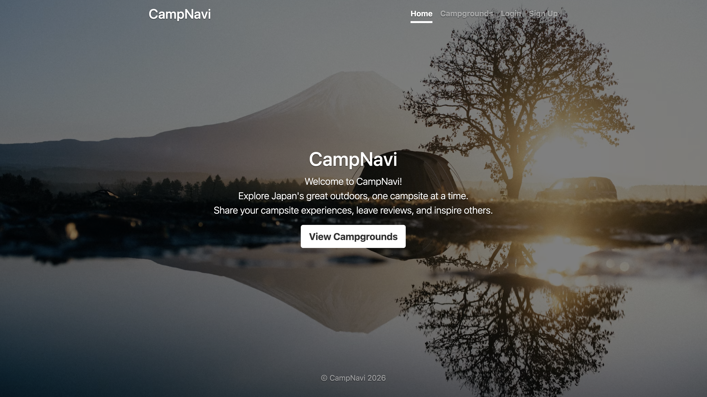
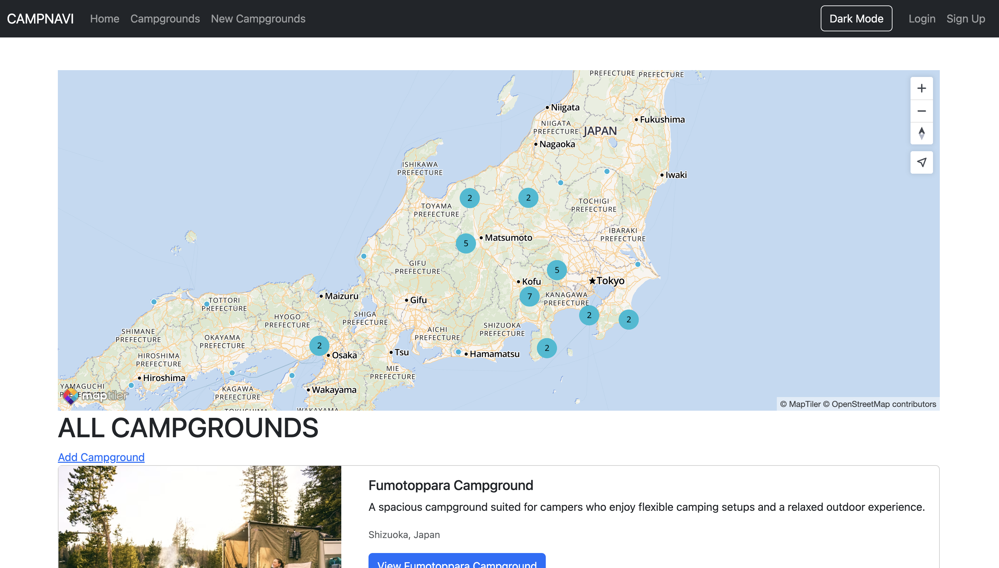
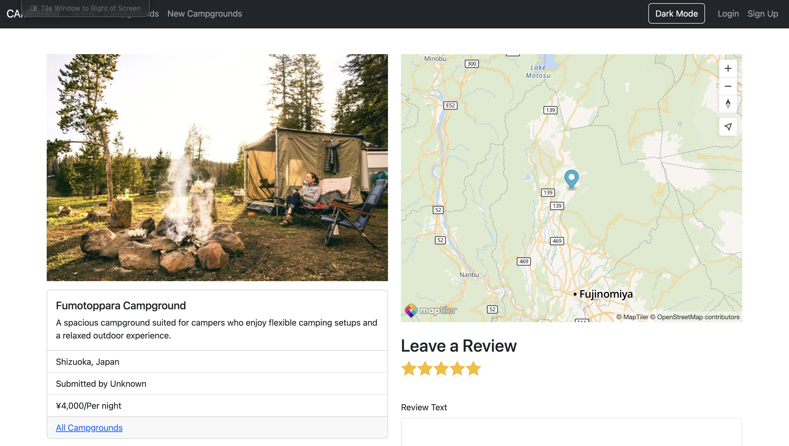

# Camp-Navi

**Explore Japan. Find your next campsite.**

Camp-Navi is a full-stack campground listing web application that allows users to browse, create, update, and delete campground listings across Japan.

The application was built as a personal full-stack development project, focusing on backend development, database design, RESTful routing, authentication, reviews, image management, and MVC application architecture.

** Live Demo:** https://camp-navi.vercel.app

** GitHub:** https://github.com/mjsdev7/Camp-Navi

---

## Features

- User registration and authentication
- User authorisation for campground and review actions
- Full CRUD functionality for campground listings
- Browse campground listings from a MongoDB database
- Detailed campground pages with images, pricing, descriptions, and locations
- Create, edit, and delete campground listings
- User reviews and ratings
- Cloudinary image storage and management
- MongoDB database integration using Mongoose
- Server-side rendering with EJS
- Form validation and error handling
- MVC-style application structure
- Real campground locations across Japan
- Database seed scripts
- Responsive interface using Bootstrap

---

## Tech Stack

### Backend

- Node.js
- Express.js
- MongoDB
- Mongoose
- EJS

### Frontend

- HTML
- CSS
- Bootstrap
- JavaScript

### Authentication & Services

- Passport.js
- Cloudinary
- MongoDB Atlas
- Vercel

---

## How It Works

### Campground Discovery

Users can browse campground listings across Japan and view detailed information including images, pricing, descriptions, locations, and coordinates.

### Campground Management

Authenticated users can create campground listings and, where authorised, edit or delete their own listings.

### Reviews

Authenticated users can leave reviews on campground listings. Review permissions ensure users can only manage reviews they are authorised to modify.

### Image Management

Campground images are uploaded and managed using Cloudinary rather than being stored directly in the application.

---

## Screenshots

### Homepage



### All Campgrounds



### Campground Details



---

## Project Architecture

```text
Camp-Navi/

├── models/
│   └── MongoDB schema definitions

├── routes/
│   └── Express route handlers

├── controllers/
│   └── Application logic

├── views/
│   └── EJS templates

├── seeds/
│   ├── index.js
│   ├── images.js
│   └── descriptions.js

├── app.js
└── package.json
```

---

## Data Model

Each campground contains:

- Title
- Image URL
- Price
- Description
- Location
- Author
- Reviews
- Geometry coordinates

---

## Setup Instructions

### 1. Clone the repository

```bash
git clone https://github.com/mjsdev7/Camp-Navi.git
cd Camp-Navi
```

### 2. Install dependencies

```bash
npm install
```

### 3. Environment Variables

Create a `.env` file in the root directory:

```text
DB_URL=your_mongodb_connection_string
CLOUDINARY_CLOUD_NAME=your_cloudinary_name
CLOUDINARY_KEY=your_cloudinary_key
CLOUDINARY_SECRET=your_cloudinary_secret
```

Add your own values before running the application.

### 4. Start MongoDB locally

Make sure MongoDB is running on your machine.

### 5. Seed the database (optional)

```bash
node seeds/index.js
```

This will populate the database with campground listings.

### 6. Run the application

```bash
node app.js
```

### 7. Open the application

Visit:

```text
http://localhost:3000
```

---

## Key Learnings

- Building RESTful routes with Express
- Working with MongoDB and Mongoose
- Creating and structuring an MVC application
- Server-side rendering with EJS
- Implementing CRUD operations
- Managing database relationships
- Creating reusable seed data
- User authentication and authorization
- Implementing reviews and ratings
- Integrating Cloudinary image storage
- Handling application errors

---

## Future Improvements

Possible future improvements include:

- Search and filtering functionality
- Interactive map integration
- Improved campground recommendations
- Additional campground discovery features
- Improved mobile experience

---

## Purpose

This project demonstrates full-stack web development skills using a real-world application architecture.

Camp-Navi focuses on backend structure, database design, RESTful routing, authentication, CRUD functionality, reviews, image management, and dynamic server-rendered frontend development.
